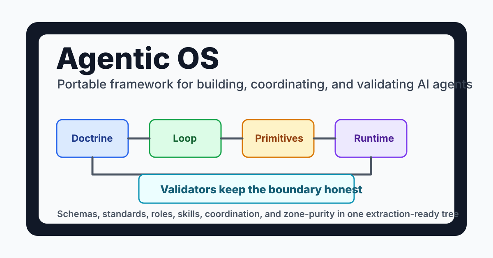
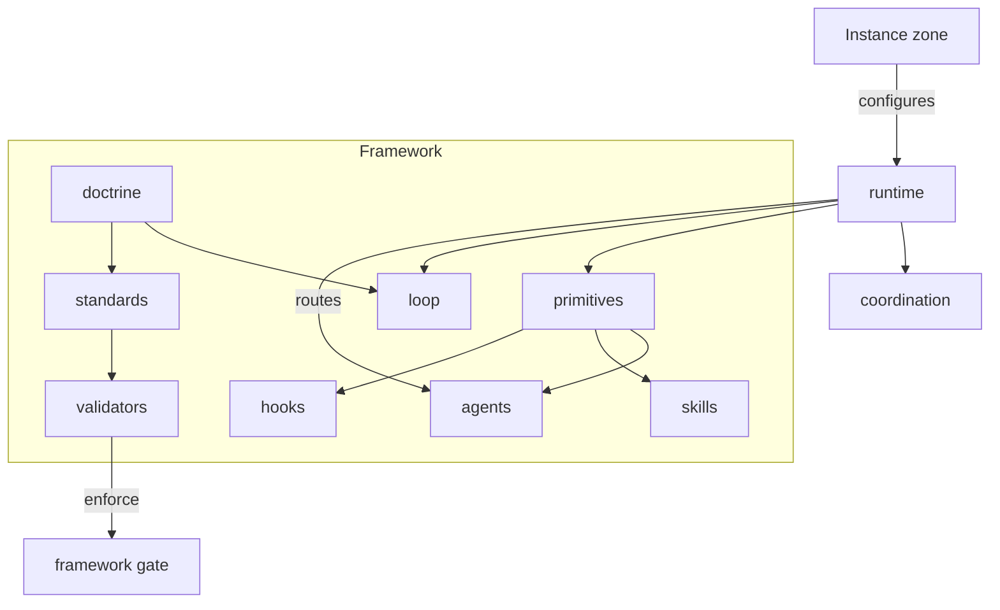
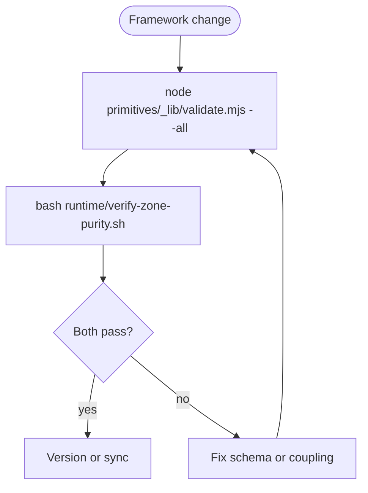

# Agentic OS — a portable framework for AI agents

[](VERSION)
[](LICENSE)
[](.github/workflows/framework-validate.yml)

A generic, instance-agnostic operating system for building, coordinating, and running AI
agents. It defines **what each building block is and how to build it**, the **doctrine**
every agent obeys, **how agents coordinate**, the **loop** they run, and **how they are
prompted** — with executable validators and a zone-purity gate that keep the whole thing
honest.



This directory is **self-contained and extraction-ready**: it carries zero coupling to any
particular deployment. To use it, lift the whole directory; layer your own deployment
specifics (hosts, credentials, client names, tuned config) into a separate *instance zone*
that the framework reads through environment variables and config files — never by editing
the framework itself.

**New here?** [`QUICKSTART.md`](QUICKSTART.md) takes you from a fresh clone to a validated framework
wired into your own project in five steps. **Changing it?** [`CONTRIBUTING.md`](CONTRIBUTING.md)
covers the zone line, the two checks every change must pass, and how to add a building block.

**Version:** [`VERSION`](VERSION) (SemVer) · changes in [`CHANGELOG.md`](CHANGELOG.md) · the
contract in [`doctrine/standards/versioning.md`](doctrine/standards/versioning.md). A release is
a public sync; an instance pins the version it synced and re-runs `validate.mjs --all` on update.

## Start Here

| You are... | Start here | Time |
|---|---|---|
| Trying the framework | [`QUICKSTART.md`](QUICKSTART.md) and the 3-command check below | 10 min |
| Adopting it into an instance | [The zone model](#the-zone-model) and [`docs/architecture.md`](docs/architecture.md) | 20 min |
| Changing framework rules | [`CONTRIBUTING.md`](CONTRIBUTING.md) and [`primitives/_lib/validate.mjs`](primitives/_lib/validate.mjs) | 20 min |

## 3-command check

From a cloned copy of this repository:

```bash
cd agentic-os
( cd primitives/_lib && npm ci )
node primitives/_lib/validate.mjs --all && bash runtime/verify-zone-purity.sh
```

Expected result: all primitive and standards validators pass, then the zone-purity gate reports
zero undocumented coupling.

## Architecture



## The zone model

The framework draws one hard line:

- **framework/ (this tree)** — generic, portable, no deployment specifics. The mechanism.
- **an instance zone (yours, kept private)** — your hosts, secrets, client names, tuned
  values. The content the mechanism reads at runtime.

A literal that names a host, a client, a credential path, or a deployment route belongs in
the instance zone, not here. That separation is **enforced**, not merely documented (see
`runtime/verify-zone-purity.sh` below).

## Layout

| Directory | What it is |
|---|---|
| [`doctrine/`](doctrine/) | **The law** — the non-negotiable rules and quality standards every agent obeys on every task. |
| [`loop/`](loop/) | **The PIV loop** — Plan → Implement → Verify, with the artifact protocol, context discipline, and verification gates. |
| [`primitives/`](primitives/) | **The building blocks** — agents, skills, hooks, commands, MCP tools, plugins, eval, memory. Each ships a spec, a JSON schema, a creator meta-skill, and a validator. |
| [`prompting/`](prompting/) | **The house style** for agent prompts. |
| [`coordination/`](coordination/) | **How agents coordinate** — file ownership, shared plans, hand-offs. |
| [`roles/`](roles/) | Reusable agent **role** definitions (architect, critic, debugger, …). |
| [`skills/`](skills/) | Generic, reusable **skills** — portable SOPs with zero instance coupling. |
| [`standards/`](standards/) | **Executable enforcement** of doctrine standards (e.g. the design-taste gate). |
| [`runtime/`](runtime/) | **The machinery** — the agent control-plane ledger engine, MCP servers, the routing engine, and the zone-purity gate. |

## Build

The runtime is an npm workspace plus some Python tooling.

```bash
cd runtime
npm install          # installs the workspace (mcp-shared, mcp-servers, router)
npm run build        # builds every workspace that defines a build
```

The Python ledger engine and its tests:

```bash
python3 -m pytest runtime/ledger/tests/ -q
```

## Validate

Every primitive carries a validator; the umbrella runner checks them all. The runner parses
frontmatter and JSON-Schema-validates primitives, so install its toolchain once first:

```bash
( cd primitives/_lib && npm ci )   # harness toolchain: ajv, yaml (one-time)
node primitives/_lib/validate.mjs --all
```

The **zone-purity gate** proves this tree carries no instance coupling — it greps the whole
tree (markdown included) for deployment literals and fails on anything not declared as an
intentional residual:

```bash
bash runtime/verify-zone-purity.sh
```

A clean checkout reports zero residuals. Any instance-specific literal that lands here is, by
construction, absent from the snapshot and fails the gate.

Both commands run in CI on every push via
[`.github/workflows/framework-validate.yml`](.github/workflows/framework-validate.yml) — the
framework dogfooding its own gate. Adopt that workflow (or fold the two commands into your own
pipeline) so a synced copy can't silently drift out of conformance.

## Validation Workflow



More visual detail: [`docs/architecture.md`](docs/architecture.md).

## License

[MIT](LICENSE).
