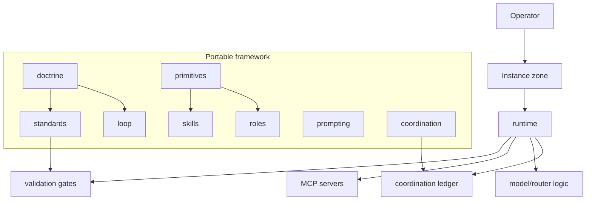
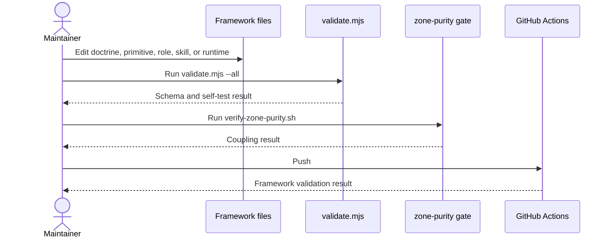

# Architecture

Agentic OS is a portable framework for building and coordinating AI agents. The framework contains
the rules, reusable primitives, runtime machinery, and validation gates. Deployment-specific
content belongs outside the framework in an instance zone.

## System Map

## Change Sequence

## Portable vs Instance Boundary

| Framework zone | Instance zone |
|---|---|
| Agent, skill, and command schemas | Private hosts and account IDs |
| Generic doctrine and standards | Client names and business context |
| Validation machinery | Secrets and credential paths |
| Role and skill templates | Local operator preferences |
| Runtime interfaces | Deployment-specific service config |

## Main Entry Points

| Need | Start |
|---|---|
| First install | [`QUICKSTART.md`](../QUICKSTART.md) |
| Contribution rules | [`CONTRIBUTING.md`](../CONTRIBUTING.md) |
| Building blocks | [`primitives/README.md`](../primitives/README.md) |
| Agent loop | [`loop/README.md`](../loop/README.md) |
| Coordination model | [`coordination/README.md`](../coordination/README.md) |
| Validation | [`primitives/_lib/validate.mjs`](../primitives/_lib/validate.mjs) and [`runtime/verify-zone-purity.sh`](../runtime/verify-zone-purity.sh) |
