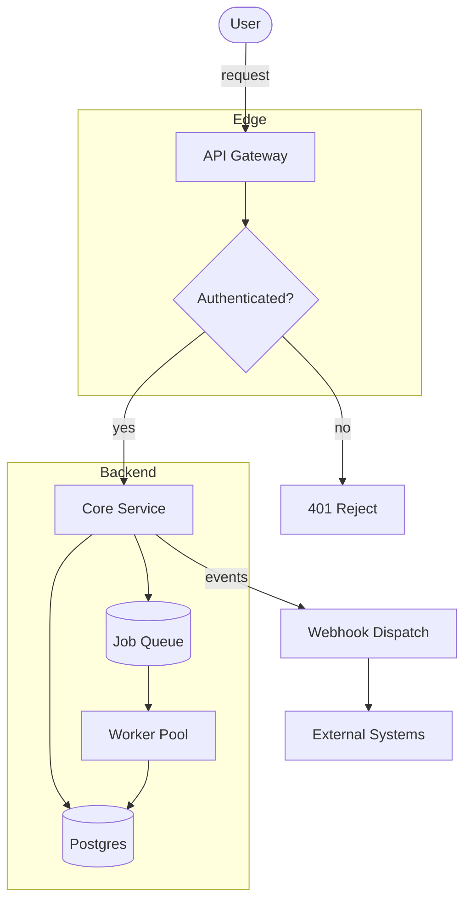
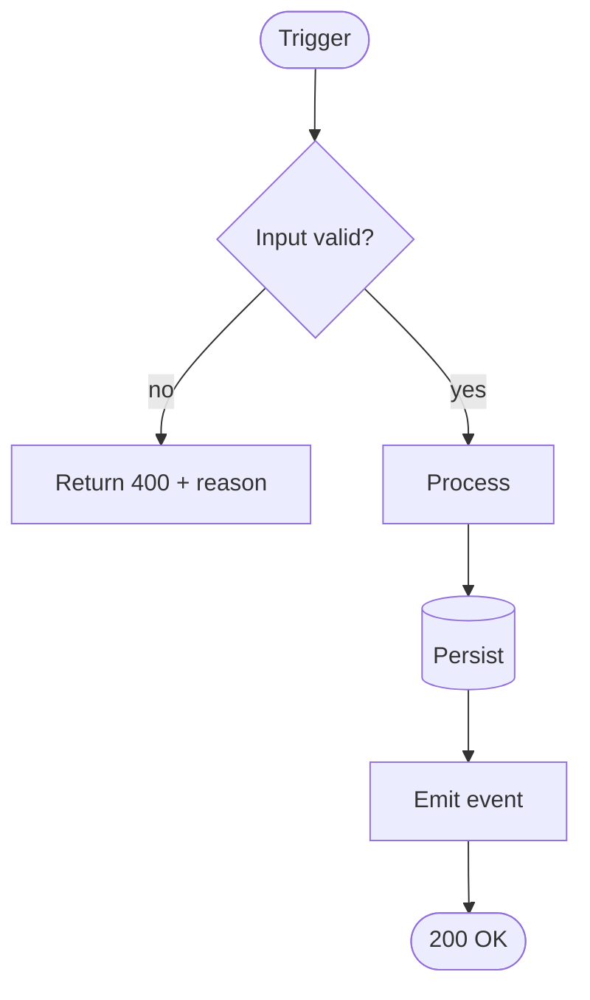
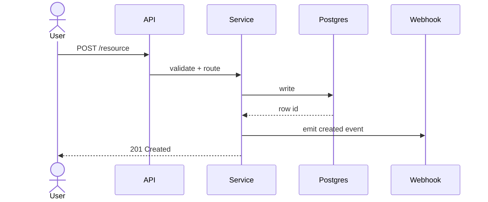
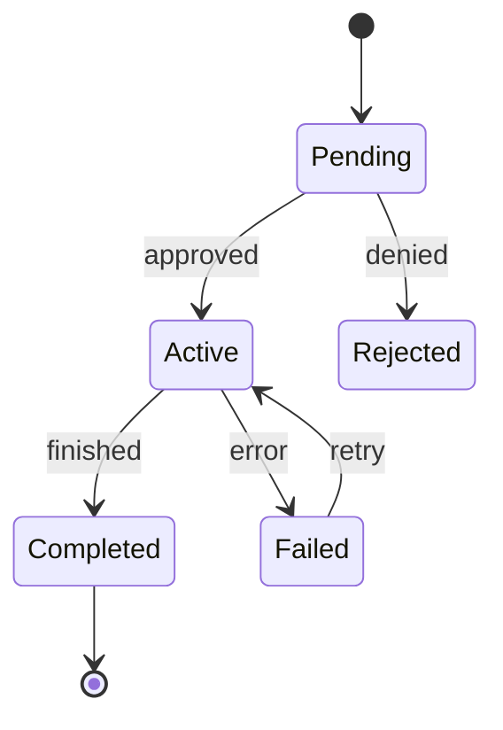
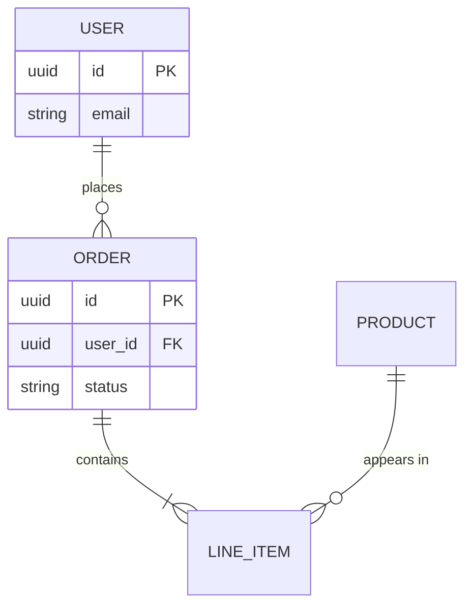

<!--
DROP-IN README TEMPLATE — Apex repo-readme standard.
Copy into a repo's README.md, then replace every <PLACEHOLDER> and every diagram
with the repo's real components. Keep the section order. Keep it ≤250 lines.
The Mermaid blocks below are real, valid, and render on GitHub — adapt, don't delete.
-->

# <Repo Name> · <one-line value prop>

<Two sentences: what it is, and the one problem it removes. No marketing.>

```bash
<the single command to install or run it>
```

---

## 🧭 Choose your path

| You are… | Start here | Time |
|---|---|---|
| 🚀 New here | [Setup](#-setup-5-min) → [First run](#first-run) | ~5 min |
| ⚡ Daily user | [Architecture](#-architecture) · [Workflows](#-workflows) | ~15 min |
| 🧠 Extending it | [docs/architecture.md](docs/architecture.md) · [docs/reference/](docs/reference/) | varies |

---

## 🏗️ Architecture

> 💡 How the pieces connect. Drill-down lives in [docs/architecture.md](docs/architecture.md).



**Components**
- **API Gateway** — <one line per box; name the real module/path>
- **Core Service** — `src/<…>`
- **Worker Pool** — `src/workers/<…>`

---

## ⏱️ Setup (5 min)

> ⏱️ Zero to first run.

1. **Install**
   ```bash
   <install cmd>
   ```
2. **Configure** — copy `.env.sample` → `.env`, fill `<KEYS>`. (Secrets via the team's secrets manager — never commit `.env`.)
   ```bash
   cp .env.sample .env
   ```
3. **Run**
   ```bash
   <run cmd>
   ```

<a id="first-run"></a>
**First run** — you should see `<expected output>`. If not, see [Troubleshooting](#-faq).

---

## 🔄 Workflows

> 💡 The main path through the system, end to end.



### Request lifecycle (who calls whom)



### Status lifecycle



---

## 🗄️ Data model
<!-- Keep only if the repo has a database. Otherwise delete this section. -->



---

## 📚 What's inside

| Path | What it holds |
|---|---|
| `src/<…>` | <core logic> |
| `docs/architecture.md` | Full architecture + drill-down diagrams |
| `docs/reference/` | API reference, config, changelog |
| `.claude/` | Agent config — commands, hooks, agents |

---

## ❓ FAQ

**<Common failure>?** — <fix in one line.>
**<Common question>?** — <answer.>

---

## 🔗 Reference

- [Architecture deep-dive](docs/architecture.md)
- [Configuration](docs/reference/config.md)
- [Changelog](docs/reference/changelog.md)
